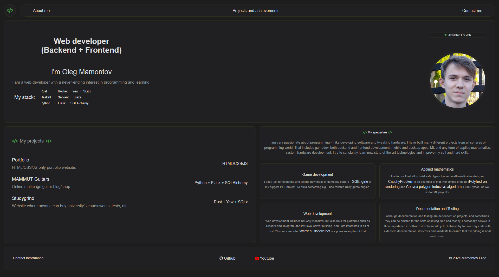
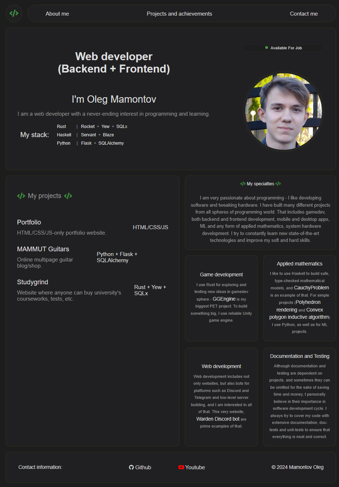
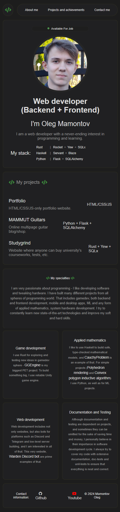

# Personal portfolio website

This `HTML`/`CSS`/`JS`-only simple website is my personal portfolio.

### Features
* Navigation bar with links to every section of website.
* 'About me' section that contains short essential information and profile picture.
* Sections with websites that are relevant to portfolio and with other projects for different specialties.
* Footer with links to my socials.

### Flexible design

Main feature of this website is responsive flexible design -
everything flawlessly adapts to the change of width.

That's how website looks on fullscreen:

That's how it looks on halved orientation:

And that's how it looks on extreme thin orientation:

You can see that both the positioning and sizing of website changes.

### Usage

Since it consists of only one index page, to view this website yourself you just need
to open 'index.html' file in any browser!

That website is a nice example of portfolio website which displays design skills 
and knowledge of bare HTML/CSS.